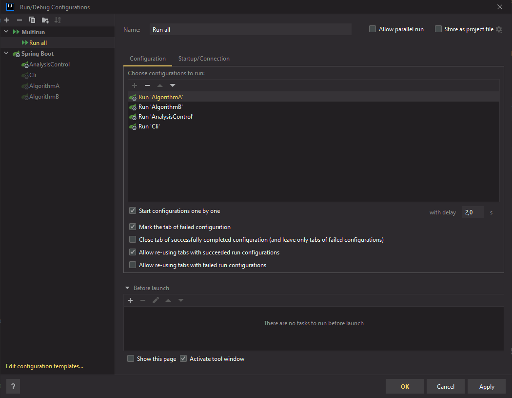
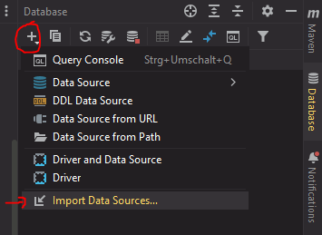
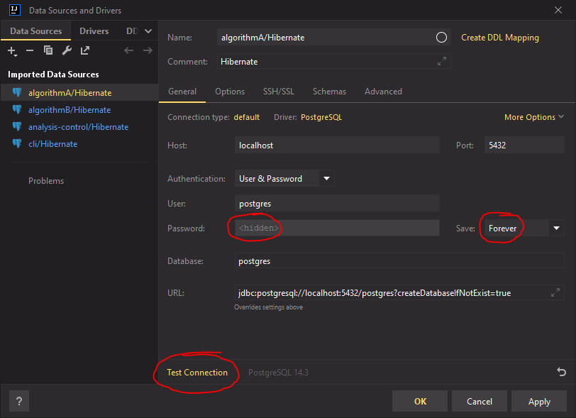
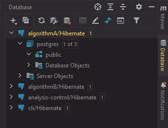

# OOKA Übung 5

In dieser Übung wurden vier Spring Boot Microservices erstellt:

- [algorithmA](algorithmA): Ein Service der 5 Sekunden dauert und ein Integer als zurückgibt.

- [algorithmB](algorithmB): Ein Service der 7,5 Sekunden dauert und ein Integer als zurückgibt.

- [analysis-control](analysis-control): Führt algorithmA und algorithmB aus berechnet das finale Resultat.

- [cli](cli): Zur Steuerung von analysis-control.

## Aufgaben

> Simulieren sie die Eingabe einer Konfiguration des Optional Equipments für eine Diesel Engine.
> Dies kann eine einfache Eingabe-Maske sein, die über einen separaten Microservice
> bereitgestellt werden kann.

Als Eingabemethode wird eine einfache [CLI](cli/src/main/java/com/ooka/cli/Cli.java) verwendet.

> Eine Konfiguration soll über einen Microservice persistent verwaltet werden können.

Die Konfiguration wird im Microservice des
[AnalysisController](analysis-control/src/main/java/com/ooka/analysis/AnalysisController.java) persistent gehalten
und kann von diesem zur Analyse verwendet werden. Ein möglicher weiterer Schritt wäre, es zu ermöglichen, die
gespeicherte Konfiguration zu editieren.

> Die eigentliche Analyse soll über einen entsprechenden Button oder einem sonstigen
> Interaktionselement ausgeführt werden können. Durch diese Interaktion wird ein bestimmter
> „Anker“-Algorithmus ausgeführt.

Als Eingabemethode wird eine einfache [CLI](cli/src/main/java/com/ooka/cli/Cli.java) verwendet.

> Wie von dem Ingenieur vorgeschlagen, sollten die Algorithmen auf choreographierte Microservices
> aufgeteilt werden, die sich nacheinander in einer Sequenz aufrufen können. [...]
> Das finale Ergebnis der Choreographie soll dann in der Benutzeroberfläche des Microservice
> dargestellt werden.

Die Algorithmen werden
vom [AnalysisController](analysis-control/src/main/java/com/ooka/analysis/AnalysisController.java)
choreografiert und aufgerufen. Das zentrale Aufrufen der Algorithmen erlaubt eine einfache Erweiterung
auf die parallele Ausführung der Algorithmen. Sind alle Algorithmen beendet, gibt der Controller das Ergebnis der
Analyse aus und speichert dieses in der persistierten Konfiguration.

> Sie können die Algorithmen nach einer eigenen Systematik clustern [...]. Somit sollten sie
> mindestens 3-4 Algorithmen bzw. Microservices bereitstellen.

Steht noch aus.

> Wie in der Anforderungsbeschreibung des Ingenieurs beschrieben, soll der Bearbeitungs-Status
> der Algorithmen in der Benutzeroberfläche der Anwendung stets zu entnehmen werden.

Es werden die im Enum [State](analysis-control/src/main/java/com/ooka/analysis/State.java) festgelegten
Zustände *IDLE*, *RUNNING*, *SUCCEEDED* und *FAILED* verwendet.

> Beachten sie zudem den Fall, dass Microservices nicht erreichbar sind. Verwenden sie das
> Pattern Circuit Breaker (Kapitel 4), um die Widerstandsfähigkeit der gesamten Anwendung
> zu garantieren.

Steht noch aus.

> Machen sie sich Gedanken über die Gestaltung der Schnittstellen der einzelnen Microservices;
> diese sollten als REST-Endpoints entwickelt werden.

Jeder Microservice verwendet REST-Controller als Schnittstellen, mit denen über HTTP-Requests
kommuniziert werden kann.

## Install

- Install Docker on your system: https://www.docker.com/get-started/

- Pull Postgres: https://hub.docker.com/_/postgres

- Install Postman: https://www.postman.com/downloads/

- Install Multirun: https://plugins.jetbrains.com/plugin/7248-multirun/



## Create all Postgres Container

```
docker run --name algoA -e POSTGRES_PASSWORD=password -p 5432:5432 -d postgres;docker run --name algoB -e POSTGRES_PASSWORD=password -p 5433:5432 -d postgres;docker run --name analysisControl -e POSTGRES_PASSWORD=password -p 5434:5432 -d postgres;docker run --name cli -e POSTGRES_PASSWORD=password -p 5435:5432 -d postgres
```

## Stop all Postgres Container:

```
docker stop $(docker ps -a -q --filter ancestor=postgres)
```

## Restart all Postgres Container:

```
docker restart $(docker ps -a -q --filter ancestor=postgres)
```

## Configure Database in Idea Ultimate

Go here:



Add the password ("password") in each data source and test the connection:



Result:



## More Links

- Microservices: https://sofienebk.medium.com/building-microservices-with-spring-boot-753be739ca7d

- 3.3. Controller Layer: https://www.javadevjournal.com/spring-boot/spring-boot-resttemplate/

- Banner: https://springhow.com/spring-boot-banner-generator/